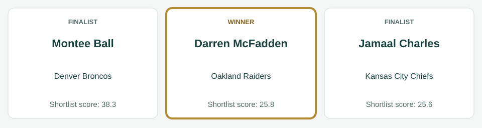
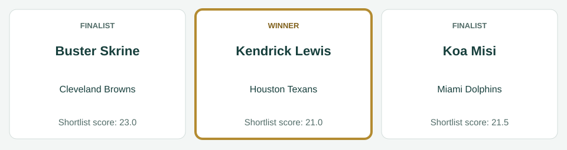
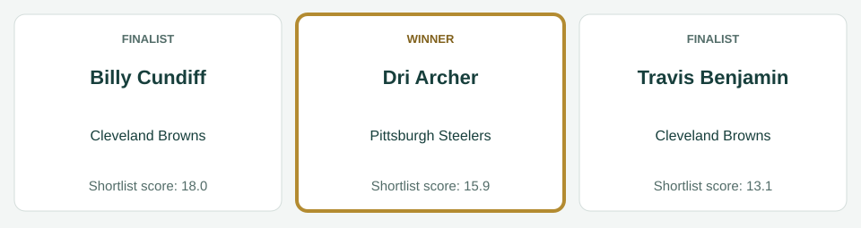
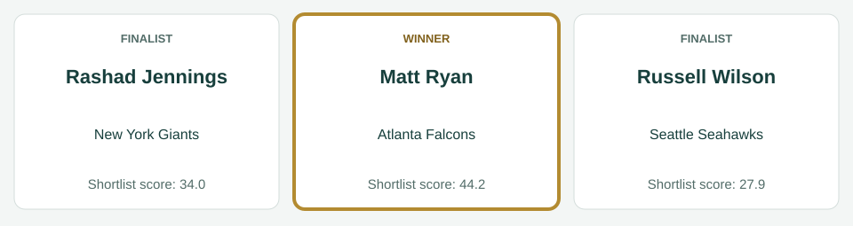
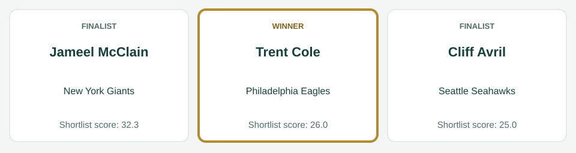
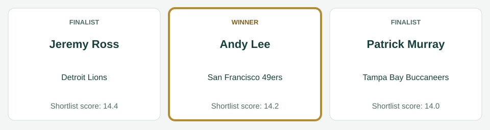

# Week 1 awards

[All regular-season awards](../README.md)

## AFC Offensive Player

| Photo | Player | Team | Shortlist score | Result |
|---|---|---|---:|---|
|  | Montee Ball | Denver Broncos | 38.3 | Finalist |
|  | Darren McFadden | Oakland Raiders | 25.8 | Winner |
|  | Jamaal Charles | Kansas City Chiefs | 25.6 | Finalist |

Scores preserve the recorded shortlist. No vote totals or second/third places are inferred.

Photos, identity imagery only: Montee Ball (Jeffrey Beall, [CC BY 3.0](https://creativecommons.org/licenses/by/3.0), [source](https://commons.wikimedia.org/wiki/File:Montee_Ball.JPG)); Darren McFadden (Jeffrey Beall, [CC BY-SA 3.0](https://creativecommons.org/licenses/by-sa/3.0), [source](https://commons.wikimedia.org/wiki/File:Darren_McFadden_Raiders.JPG)); Jamaal Charles (Jeffrey Beall, [CC BY-SA 3.0](https://creativecommons.org/licenses/by-sa/3.0), [source](https://commons.wikimedia.org/wiki/File:Jamaal_Charles.JPG)).

## AFC Defensive Player

| Photo | Player | Team | Shortlist score | Result |
|---|---|---|---:|---|
|  | Buster Skrine | Cleveland Browns | 23.0 | Finalist |
|  | Koa Misi | Miami Dolphins | 21.5 | Finalist |
|  | Kendrick Lewis | Houston Texans | 21.0 | Winner |

Scores preserve the recorded shortlist. No vote totals or second/third places are inferred.

Photos, identity imagery only: Buster Skrine (Erik Drost from United States, [CC BY 2.0](https://creativecommons.org/licenses/by/2.0), [source](https://commons.wikimedia.org/wiki/File:Buster_Skrine_cropped.jpg)); Koa Misi (June Rivera, [CC BY-SA 2.0](https://creativecommons.org/licenses/by-sa/2.0), [source](https://commons.wikimedia.org/wiki/File:Koa_Misi_in_2012.jpg)); Kendrick Lewis (Jeffrey Beall, [CC BY 3.0](https://creativecommons.org/licenses/by/3.0), [source](https://commons.wikimedia.org/wiki/File:Kendrick_Lewis_2014.JPG)).

## AFC Special Teams Player

| Photo | Player | Team | Shortlist score | Result |
|---|---|---|---:|---|
|  | Billy Cundiff | Cleveland Browns | 18.0 | Finalist |
|  | Dri Archer | Pittsburgh Steelers | 15.9 | Winner |
|  | Travis Benjamin | Cleveland Browns | 13.1 | Finalist |

Scores preserve the recorded shortlist. No vote totals or second/third places are inferred.

Photos, identity imagery only: Billy Cundiff (Thibous, [CC BY-SA 3.0](https://creativecommons.org/licenses/by-sa/3.0), [source](https://commons.wikimedia.org/wiki/File:Billy_Cundiff_2011_stadium_practice.jpg)); Travis Benjamin (Jeffrey Beall, [CC BY-SA 3.0](https://creativecommons.org/licenses/by-sa/3.0), [source](https://commons.wikimedia.org/wiki/File:Travis_Benjamin.JPG)).

## NFC Offensive Player

| Photo | Player | Team | Shortlist score | Result |
|---|---|---|---:|---|
|  | Matt Ryan | Atlanta Falcons | 44.2 | Winner |
|  | Rashad Jennings | New York Giants | 34.0 | Finalist |
|  | Russell Wilson | Seattle Seahawks | 27.9 | Finalist |

Scores preserve the recorded shortlist. No vote totals or second/third places are inferred.

Photos, identity imagery only: Matt Ryan (All-Pro Reels from District of Columbia, USA, [CC BY-SA 2.0](https://creativecommons.org/licenses/by-sa/2.0), [source](https://commons.wikimedia.org/wiki/File:Washington_Football_Team_at_Atlanta_Falcons_(3_October_2021)_DSC_4628_(51555290664)_(cropped).jpg)); Rashad Jennings (Keith Allison from Hanover, MD, USA, [CC BY-SA 2.0](https://creativecommons.org/licenses/by-sa/2.0), [source](https://commons.wikimedia.org/wiki/File:Rashad_Jennings.jpg)); Russell Wilson (Aqwfyj, [CC BY-SA 3.0](https://creativecommons.org/licenses/by-sa/3.0), [source](https://commons.wikimedia.org/wiki/File:Russell_Wilson_at_the_2013_Jessie_Vetter_Classic,_July_1,_2013.jpg)).

## NFC Defensive Player

| Photo | Player | Team | Shortlist score | Result |
|---|---|---|---:|---|
|  | Jameel McClain | New York Giants | 32.3 | Finalist |
|  | Trent Cole | Philadelphia Eagles | 26.0 | Winner |
|  | Cliff Avril | Seattle Seahawks | 25.0 | Finalist |

Scores preserve the recorded shortlist. No vote totals or second/third places are inferred.

Photos, identity imagery only: Jameel McClain (Thibous, [CC BY-SA 3.0](https://creativecommons.org/licenses/by-sa/3.0), [source](https://commons.wikimedia.org/wiki/File:Jameel_McClain_2011_stadium_practice.jpg)); Trent Cole (Tech. Sgt. Scott T. Sturkol, Public domain, [source](https://commons.wikimedia.org/wiki/File:Trent_Cole_080805-F-9429S-132_crop.jpg)); Cliff Avril (Jeffrey Beall, [CC BY 3.0](https://creativecommons.org/licenses/by/3.0), [source](https://commons.wikimedia.org/wiki/File:Cliff_Avril_2014.JPG)).

## NFC Special Teams Player

| Photo | Player | Team | Shortlist score | Result |
|---|---|---|---:|---|
|  | Jeremy Ross | Detroit Lions | 14.4 | Finalist |
|  | Andy Lee | San Francisco 49ers | 14.2 | Winner |
|  | Patrick Murray | Tampa Bay Buccaneers | 14.0 | Finalist |

Scores preserve the recorded shortlist. No vote totals or second/third places are inferred.

Photos, identity imagery only: Jeremy Ross (original: John Martinez Pavliga derivative: Diddykong1130, [CC BY 2.0](https://creativecommons.org/licenses/by/2.0), [source](https://commons.wikimedia.org/wiki/File:Jeremy_Ross_Golden_Bears.jpg)); Andy Lee (Jeffrey Beall, [CC BY-SA 3.0](https://creativecommons.org/licenses/by-sa/3.0), [source](https://commons.wikimedia.org/wiki/File:Andy_Lee_(American_football).JPG)); Patrick Murray (Keith Allison, [CC BY-SA 2.0](https://creativecommons.org/licenses/by-sa/2.0), [source](https://commons.wikimedia.org/wiki/File:Patrick_Murray_field_goal_vs._Redskins_Cropped.jpg)).
