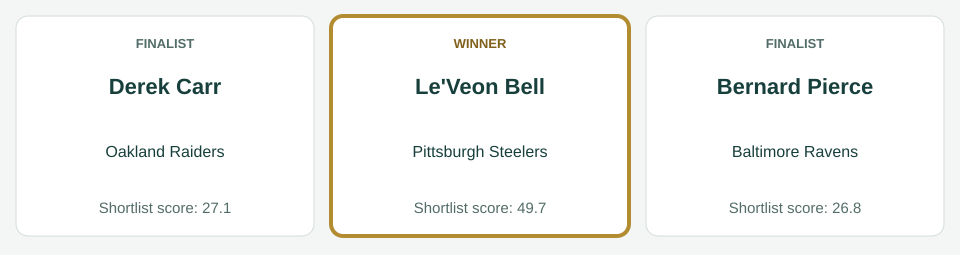
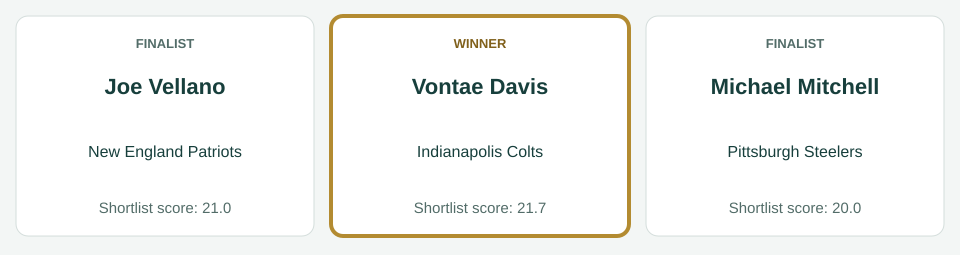
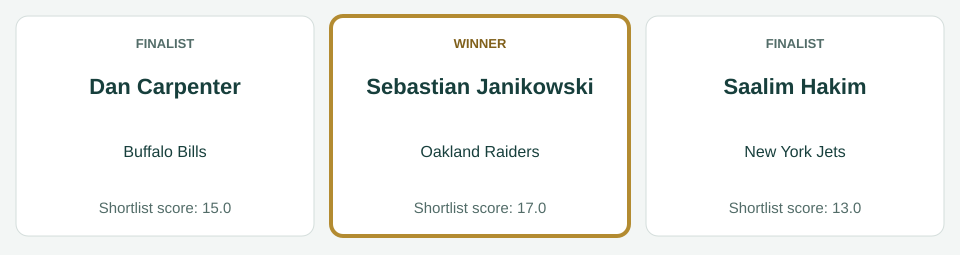
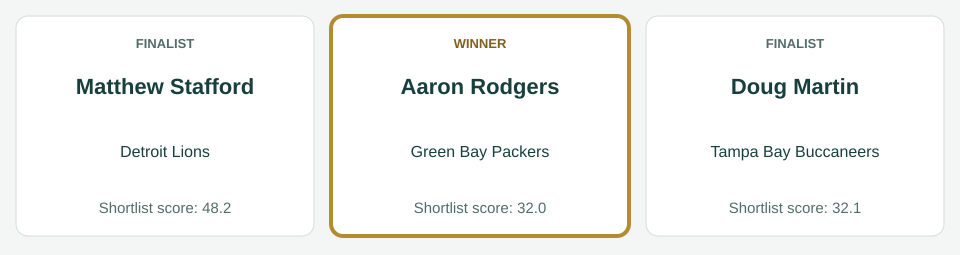
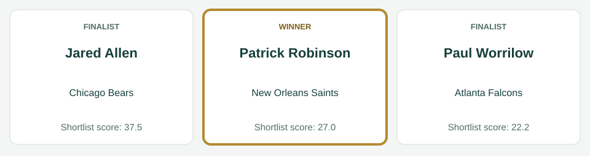
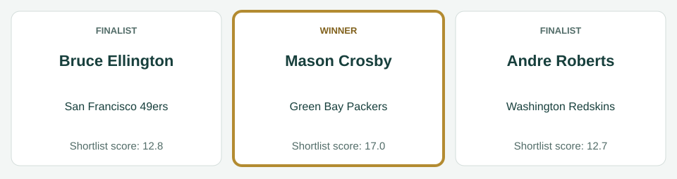

# Week 2 awards

[All regular-season awards](../README.md)

## AFC Offensive Player

| Photo | Player | Team | Shortlist score | Result |
|---|---|---|---:|---|
|  | Le'Veon Bell | Pittsburgh Steelers | 49.7 | Winner |
|  | Derek Carr | Oakland Raiders | 27.1 | Finalist |
|  | Bernard Pierce | Baltimore Ravens | 26.8 | Finalist |

Scores preserve the recorded shortlist. No vote totals or second/third places are inferred.

Photos, identity imagery only: Le'Veon Bell (I, the copyright holder of this work, hereby publish it under the following license:, [CC BY-SA 3.0](https://creativecommons.org/licenses/by-sa/3.0), [source](https://commons.wikimedia.org/wiki/File:LeVeon_Bell_26_practicing_2013.jpg)); Derek Carr (All-Pro Reels, [CC BY-SA 2.0](https://creativecommons.org/licenses/by-sa/2.0), [source](https://commons.wikimedia.org/wiki/File:Derek_Carr_WFT_at_Raiders_-_51735347857_(cropped).jpg)); Bernard Pierce (Thibous, [CC BY-SA 3.0](https://creativecommons.org/licenses/by-sa/3.0), [source](https://commons.wikimedia.org/wiki/File:Bernard_Pierce_Navy_Stadium_2012_Practice.jpg)).

## AFC Defensive Player

| Photo | Player | Team | Shortlist score | Result |
|---|---|---|---:|---|
|  | Vontae Davis | Indianapolis Colts | 21.7 | Winner |
|  | Joe Vellano | New England Patriots | 21.0 | Finalist |
|  | Michael Mitchell | Pittsburgh Steelers | 20.0 | Finalist |

Scores preserve the recorded shortlist. No vote totals or second/third places are inferred.

Photos, identity imagery only: Vontae Davis (FanDuel, [CC BY 3.0](https://creativecommons.org/licenses/by/3.0), [source](https://commons.wikimedia.org/wiki/File:Vontae_Davis_2018_01.png)); Joe Vellano (U.S. Navy photo by Mass Communication Specialist 3rd Class Pyoung K. Yi/Released, Public domain, [source](https://commons.wikimedia.org/wiki/File:Joe_Vellano_(1691317)_(cropped).jpg)); Michael Mitchell (Jeffrey Beall, [CC BY-SA 3.0](https://creativecommons.org/licenses/by-sa/3.0), [source](https://commons.wikimedia.org/wiki/File:Mike_Mitchell_(safety).JPG)).

## AFC Special Teams Player

| Photo | Player | Team | Shortlist score | Result |
|---|---|---|---:|---|
|  | Sebastian Janikowski | Oakland Raiders | 17.0 | Winner |
|  | Dan Carpenter | Buffalo Bills | 15.0 | Finalist |
|  | Saalim Hakim | New York Jets | 13.0 | Finalist |

Scores preserve the recorded shortlist. No vote totals or second/third places are inferred.

Photos, identity imagery only: Sebastian Janikowski (Jeffrey Beall, [CC BY 4.0](https://creativecommons.org/licenses/by/4.0), [source](https://commons.wikimedia.org/wiki/File:Sebastian_Janikowski_2018.JPG)); Dan Carpenter (Chrisjnelson at en.wikipedia, [CC BY 3.0](https://creativecommons.org/licenses/by/3.0), [source](https://commons.wikimedia.org/wiki/File:Dan_Carpenter1.jpg)).

## NFC Offensive Player

| Photo | Player | Team | Shortlist score | Result |
|---|---|---|---:|---|
|  | Matthew Stafford | Detroit Lions | 48.2 | Finalist |
|  | Doug Martin | Tampa Bay Buccaneers | 32.1 | Finalist |
|  | Aaron Rodgers | Green Bay Packers | 32.0 | Winner |

Scores preserve the recorded shortlist. No vote totals or second/third places are inferred.

Photos, identity imagery only: Matthew Stafford (Keith Allison, [CC BY-SA 2.0](https://creativecommons.org/licenses/by-sa/2.0), [source](https://commons.wikimedia.org/wiki/File:Matthew_Stafford_2015.jpg)); Doug Martin (Stephanie Rush, Pacific Regional Medical Command Public Affairs, Public domain, [source](https://commons.wikimedia.org/wiki/File:Doug_Martin_at_Schoffield_Barracks_(cropped).jpg)); Aaron Rodgers (All-Pro Reels, [CC BY-SA 2.0](https://creativecommons.org/licenses/by-sa/2.0), [source](https://commons.wikimedia.org/wiki/File:Aaron_Rodgers_Packers_OCT2021_(cropped).jpg)).

## NFC Defensive Player

| Photo | Player | Team | Shortlist score | Result |
|---|---|---|---:|---|
|  | Jared Allen | Chicago Bears | 37.5 | Finalist |
|  | Patrick Robinson | New Orleans Saints | 27.0 | Winner |
|  | Paul Worrilow | Atlanta Falcons | 22.2 | Finalist |

Scores preserve the recorded shortlist. No vote totals or second/third places are inferred.

Photos, identity imagery only: Jared Allen (MN National Guard, [CC BY 3.0](https://creativecommons.org/licenses/by/3.0), [source](https://commons.wikimedia.org/wiki/File:Jared_Allen_2009.JPG)); Patrick Robinson (Jeffrey Beall, [CC BY-SA 3.0](https://creativecommons.org/licenses/by-sa/3.0), [source](https://commons.wikimedia.org/wiki/File:Patrick_Robinson_(cornerback).JPG)); Paul Worrilow (Thomson200, [CC0](http://creativecommons.org/publicdomain/zero/1.0/deed.en), [source](https://commons.wikimedia.org/wiki/File:Paul_Worrilow_2013.jpg)).

## NFC Special Teams Player

| Photo | Player | Team | Shortlist score | Result |
|---|---|---|---:|---|
|  | Mason Crosby | Green Bay Packers | 17.0 | Winner |
|  | Bruce Ellington | San Francisco 49ers | 12.8 | Finalist |
|  | Andre Roberts | Washington Redskins | 12.7 | Finalist |

Scores preserve the recorded shortlist. No vote totals or second/third places are inferred.

Photos, identity imagery only: Mason Crosby (Paul Cutler, [CC BY-SA 2.0](https://creativecommons.org/licenses/by-sa/2.0), [source](https://commons.wikimedia.org/wiki/File:Mason_Crosby_kicks_a_field_goal_for_Green_Bay_Packers_off_ball_held_by_Jon_Ryan_during_October_7,_2007_game_against_Chicago_Bears_at_Lambeau_Field_in_Green_Bay.jpg)); Bruce Ellington (Gamecock Central, [CC BY 2.0](https://creativecommons.org/licenses/by/2.0), [source](https://commons.wikimedia.org/wiki/File:Bruce_Ellington.jpg)); Andre Roberts (Keith Allison from Hanover, MD, USA, [CC BY-SA 2.0](https://creativecommons.org/licenses/by-sa/2.0), [source](https://commons.wikimedia.org/wiki/File:Andre_Roberts_2018.jpg)).
