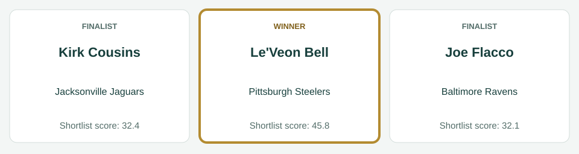
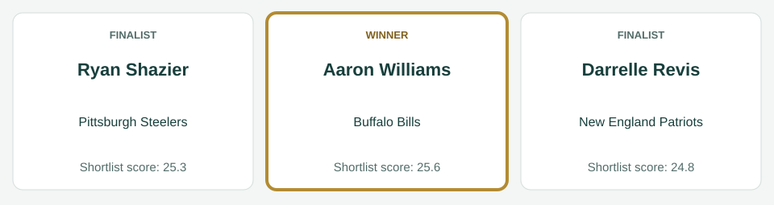
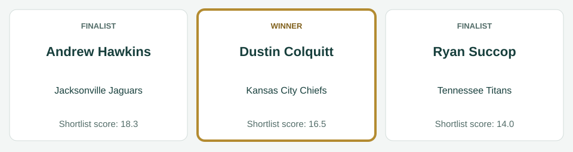
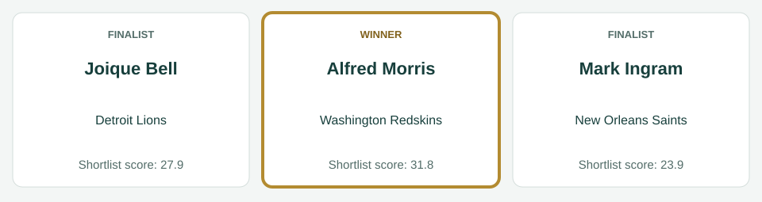
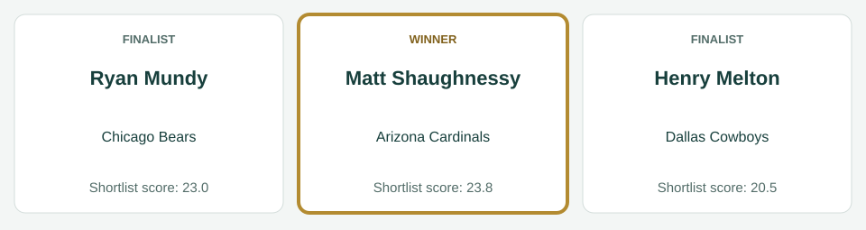
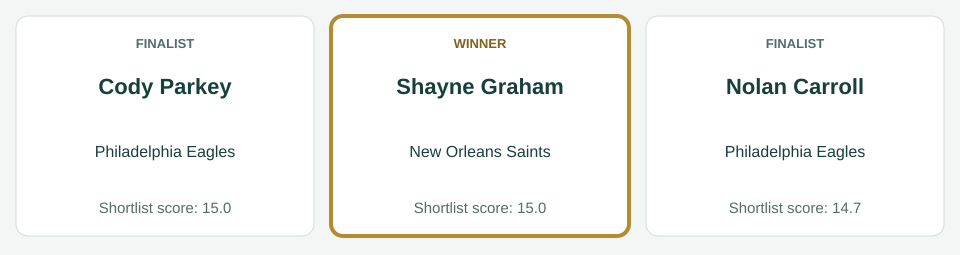

# Week 3 awards

[All regular-season awards](../README.md)

## AFC Offensive Player

| Photo | Player | Team | Shortlist score | Result |
|---|---|---|---:|---|
|  | Le'Veon Bell | Pittsburgh Steelers | 45.8 | Winner |
|  | Kirk Cousins | Jacksonville Jaguars | 32.4 | Finalist |
|  | Joe Flacco | Baltimore Ravens | 32.1 | Finalist |

Scores preserve the recorded shortlist. No vote totals or second/third places are inferred.

Photos, identity imagery only: Le'Veon Bell (I, the copyright holder of this work, hereby publish it under the following license:, [CC BY-SA 3.0](https://creativecommons.org/licenses/by-sa/3.0), [source](https://commons.wikimedia.org/wiki/File:LeVeon_Bell_26_practicing_2013.jpg)); Kirk Cousins (All-Pro Reels, [CC BY-SA 2.0](https://creativecommons.org/licenses/by-sa/2.0), [source](https://commons.wikimedia.org/wiki/File:Cousins_2022.jpg)); Joe Flacco (Erik Drost, [CC BY 4.0](https://creativecommons.org/licenses/by/4.0), [source](https://commons.wikimedia.org/wiki/File:Joe_Flacco_2025_Browns_Camp_-_54694425196_(cropped).jpg)).

## AFC Defensive Player

| Photo | Player | Team | Shortlist score | Result |
|---|---|---|---:|---|
|  | Aaron Williams | Buffalo Bills | 25.6 | Winner |
|  | Ryan Shazier | Pittsburgh Steelers | 25.3 | Finalist |
|  | Darrelle Revis | New England Patriots | 24.8 | Finalist |

Scores preserve the recorded shortlist. No vote totals or second/third places are inferred.

Photos, identity imagery only: Aaron Williams (Jeffrey Beall, [CC BY-SA 3.0](https://creativecommons.org/licenses/by-sa/3.0), [source](https://commons.wikimedia.org/wiki/File:Aaron_Williams_(American_football).JPG)); Ryan Shazier (David Schellhaas, [CC BY 2.0](https://creativecommons.org/licenses/by/2.0), [source](https://commons.wikimedia.org/wiki/File:Ryan_Shazier.jpg)); Darrelle Revis (Jeff Kern, [CC BY 2.0](https://creativecommons.org/licenses/by/2.0), [source](https://commons.wikimedia.org/wiki/File:Darrelle_Revis_ESPNWeekend2010-051.jpg)).

## AFC Special Teams Player

| Photo | Player | Team | Shortlist score | Result |
|---|---|---|---:|---|
|  | Andrew Hawkins | Jacksonville Jaguars | 18.3 | Finalist |
|  | Dustin Colquitt | Kansas City Chiefs | 16.5 | Winner |
|  | Ryan Succop | Tennessee Titans | 14.0 | Finalist |

Scores preserve the recorded shortlist. No vote totals or second/third places are inferred.

Photos, identity imagery only: Andrew Hawkins (original: Navin75 derivative: Diddykong1130, [CC BY-SA 2.0](https://creativecommons.org/licenses/by-sa/2.0), [source](https://commons.wikimedia.org/wiki/File:Andrew_hawkins_bengals.jpg)); Dustin Colquitt (Time2Football, [CC BY 3.0](https://creativecommons.org/licenses/by/3.0), [source](https://commons.wikimedia.org/wiki/File:Chiefs_Punter_Dustin_Colquitt_Super_Bowl_54_Interview_(cropped).png)); Ryan Succop (Jeffrey Beall, [CC BY-SA 3.0](https://creativecommons.org/licenses/by-sa/3.0), [source](https://commons.wikimedia.org/wiki/File:Ryan_Succop.JPG)).

## NFC Offensive Player

| Photo | Player | Team | Shortlist score | Result |
|---|---|---|---:|---|
|  | Alfred Morris | Washington Redskins | 31.8 | Winner |
|  | Joique Bell | Detroit Lions | 27.9 | Finalist |
|  | Mark Ingram | New Orleans Saints | 23.9 | Finalist |

Scores preserve the recorded shortlist. No vote totals or second/third places are inferred.

Photos, identity imagery only: Alfred Morris (Keith Allison, [CC BY-SA 2.0](https://creativecommons.org/licenses/by-sa/2.0), [source](https://commons.wikimedia.org/wiki/File:Alfred_morris_redskins.jpg)); Joique Bell (Kevin Doebler, [CC BY-SA 3.0](https://creativecommons.org/licenses/by-sa/3.0), [source](https://commons.wikimedia.org/wiki/File:Joique_Bell_warming_up_before_a_Detroit_Lions_football_game_on_2013-09-29.jpg)); Mark Ingram (Executive Office of the President, Public domain, [source](https://commons.wikimedia.org/wiki/File:Mark_Ingram,_Jr._at_the_White_House_2010-03-08_3.jpg)).

## NFC Defensive Player

| Photo | Player | Team | Shortlist score | Result |
|---|---|---|---:|---|
|  | Matt Shaughnessy | Arizona Cardinals | 23.8 | Winner |
|  | Ryan Mundy | Chicago Bears | 23.0 | Finalist |
|  | Henry Melton | Dallas Cowboys | 20.5 | Finalist |

Scores preserve the recorded shortlist. No vote totals or second/third places are inferred.

Photos, identity imagery only: Matt Shaughnessy (Jeffrey Beall, [CC BY-SA 3.0](https://creativecommons.org/licenses/by-sa/3.0), [source](https://commons.wikimedia.org/wiki/File:Matt_Shaughnessy.JPG)); Ryan Mundy (original: U.S. Army Photo by Sgt. 1st Class Michel Sauret on behalf of 416th Theater Engineer Command Army Reserve derivative: Diddykong1130, Public domain, [source](https://commons.wikimedia.org/wiki/File:Ryan_mundy_bears.jpg)); Henry Melton (Quinnanmatt, [CC BY-SA 3.0](https://creativecommons.org/licenses/by-sa/3.0), [source](https://commons.wikimedia.org/wiki/File:Melton_Quinnan_123.jpg)).

## NFC Special Teams Player

| Photo | Player | Team | Shortlist score | Result |
|---|---|---|---:|---|
|  | Cody Parkey | Philadelphia Eagles | 15.0 | Finalist |
|  | Shayne Graham | New Orleans Saints | 15.0 | Winner |
|  | Nolan Carroll | Philadelphia Eagles | 14.7 | Finalist |

Scores preserve the recorded shortlist. No vote totals or second/third places are inferred.

Photos, identity imagery only: Cody Parkey (Sgt. Staci Miller, Public domain, [source](https://commons.wikimedia.org/wiki/File:Cody_Parkey.jpg)); Shayne Graham (Keith Allison from Baltimore, USA, [CC BY-SA 2.0](https://creativecommons.org/licenses/by-sa/2.0), [source](https://commons.wikimedia.org/wiki/File:Shayne_Graham_2006-11-05.jpg)); Nolan Carroll (Chrisjnelson at en.wikipedia, [CC BY 3.0](https://creativecommons.org/licenses/by/3.0), [source](https://commons.wikimedia.org/wiki/File:Nolan_Carroll.jpg)).
