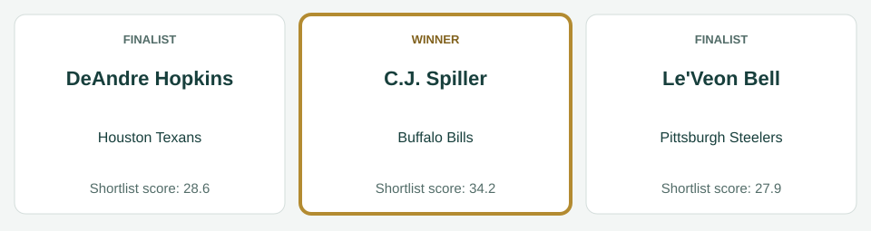
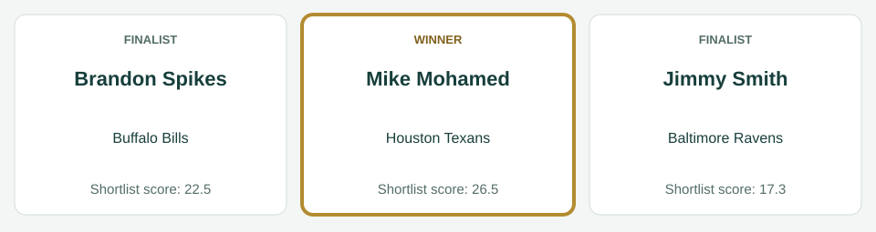
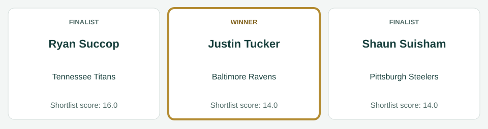
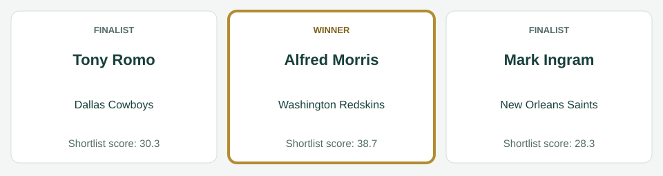
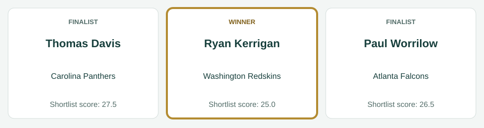
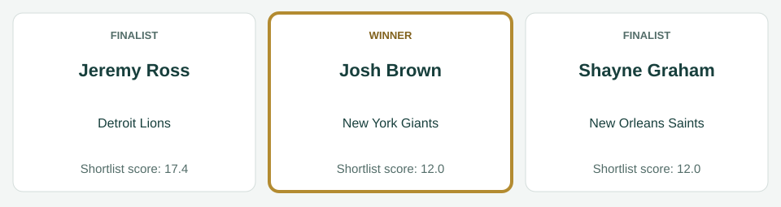

# Week 4 awards

[All regular-season awards](../README.md)

## AFC Offensive Player

| Photo | Player | Team | Shortlist score | Result |
|---|---|---|---:|---|
|  | C.J. Spiller | Buffalo Bills | 34.2 | Winner |
|  | DeAndre Hopkins | Houston Texans | 28.6 | Finalist |
|  | Le'Veon Bell | Pittsburgh Steelers | 27.9 | Finalist |

Scores preserve the recorded shortlist. No vote totals or second/third places are inferred.

Photos, identity imagery only: C.J. Spiller (Keith Allison, [CC BY-SA 2.0](https://creativecommons.org/licenses/by-sa/2.0), [source](https://commons.wikimedia.org/wiki/File:C.J._Spiller_2015.jpg)); DeAndre Hopkins (All-Pro Reels, [CC BY-SA 2.0](https://creativecommons.org/licenses/by-sa/2.0), [source](https://commons.wikimedia.org/wiki/File:DeAndre_Hopkins_2020.jpg)); Le'Veon Bell (I, the copyright holder of this work, hereby publish it under the following license:, [CC BY-SA 3.0](https://creativecommons.org/licenses/by-sa/3.0), [source](https://commons.wikimedia.org/wiki/File:LeVeon_Bell_26_practicing_2013.jpg)).

## AFC Defensive Player

| Photo | Player | Team | Shortlist score | Result |
|---|---|---|---:|---|
|  | Mike Mohamed | Houston Texans | 26.5 | Winner |
|  | Brandon Spikes | Buffalo Bills | 22.5 | Finalist |
|  | Jimmy Smith | Baltimore Ravens | 17.3 | Finalist |

Scores preserve the recorded shortlist. No vote totals or second/third places are inferred.

Photos, identity imagery only: Mike Mohamed (Jeffrey Beall, [CC BY-SA 3.0](https://creativecommons.org/licenses/by-sa/3.0), [source](https://commons.wikimedia.org/wiki/File:Mike_Mohamed.JPG)); Brandon Spikes (Jeffrey Beall, [CC BY 3.0](https://creativecommons.org/licenses/by/3.0), [source](https://commons.wikimedia.org/wiki/File:Brandon_Spikes.JPG)); Jimmy Smith (Thibous, [CC BY-SA 3.0](https://creativecommons.org/licenses/by-sa/3.0), [source](https://commons.wikimedia.org/wiki/File:Jimmy_smith_2011_stadium_practice.jpg)).

## AFC Special Teams Player

| Photo | Player | Team | Shortlist score | Result |
|---|---|---|---:|---|
|  | Ryan Succop | Tennessee Titans | 16.0 | Finalist |
|  | Justin Tucker | Baltimore Ravens | 14.0 | Winner |
|  | Shaun Suisham | Pittsburgh Steelers | 14.0 | Finalist |

Scores preserve the recorded shortlist. No vote totals or second/third places are inferred.

Photos, identity imagery only: Ryan Succop (Jeffrey Beall, [CC BY-SA 3.0](https://creativecommons.org/licenses/by-sa/3.0), [source](https://commons.wikimedia.org/wiki/File:Ryan_Succop.JPG)); Justin Tucker (Maryland GovPics, [CC BY 2.0](https://creativecommons.org/licenses/by/2.0), [source](https://commons.wikimedia.org/wiki/File:Justin_Tucker_(cropped).jpg)); Shaun Suisham (Sodexo USA, [CC BY 2.0](https://creativecommons.org/licenses/by/2.0), [source](https://commons.wikimedia.org/wiki/File:Suisham_closeup.jpg)).

## NFC Offensive Player

| Photo | Player | Team | Shortlist score | Result |
|---|---|---|---:|---|
|  | Alfred Morris | Washington Redskins | 38.7 | Winner |
|  | Tony Romo | Dallas Cowboys | 30.3 | Finalist |
|  | Mark Ingram | New Orleans Saints | 28.3 | Finalist |

Scores preserve the recorded shortlist. No vote totals or second/third places are inferred.

Photos, identity imagery only: Alfred Morris (Keith Allison, [CC BY-SA 2.0](https://creativecommons.org/licenses/by-sa/2.0), [source](https://commons.wikimedia.org/wiki/File:Alfred_morris_redskins.jpg)); Tony Romo (MC2 Elisia V. Gonzales, USN, Public domain, [source](https://commons.wikimedia.org/wiki/File:Tony_Romo_before_2008_Pro_Bowl_(cropped).JPEG)); Mark Ingram (Executive Office of the President, Public domain, [source](https://commons.wikimedia.org/wiki/File:Mark_Ingram,_Jr._at_the_White_House_2010-03-08_3.jpg)).

## NFC Defensive Player

| Photo | Player | Team | Shortlist score | Result |
|---|---|---|---:|---|
|  | Thomas Davis | Carolina Panthers | 27.5 | Finalist |
|  | Paul Worrilow | Atlanta Falcons | 26.5 | Finalist |
|  | Ryan Kerrigan | Washington Redskins | 25.0 | Winner |

Scores preserve the recorded shortlist. No vote totals or second/third places are inferred.

Photos, identity imagery only: Thomas Davis (original: Spc. Klinton Smith of the 3d U.S. Infantry Regiment of the United States Army derivative: Diddykong1130, Public domain, [source](https://commons.wikimedia.org/wiki/File:Thomas_davis_2014.jpg)); Paul Worrilow (Thomson200, [CC0](http://creativecommons.org/publicdomain/zero/1.0/deed.en), [source](https://commons.wikimedia.org/wiki/File:Paul_Worrilow_2013.jpg)); Ryan Kerrigan (Jeffrey Beall, [CC BY 3.0](https://creativecommons.org/licenses/by/3.0), [source](https://commons.wikimedia.org/wiki/File:Ryan_Kerrigan.JPG)).

## NFC Special Teams Player

| Photo | Player | Team | Shortlist score | Result |
|---|---|---|---:|---|
|  | Jeremy Ross | Detroit Lions | 17.4 | Finalist |
|  | Josh Brown | New York Giants | 12.0 | Winner |
|  | Shayne Graham | New Orleans Saints | 12.0 | Finalist |

Scores preserve the recorded shortlist. No vote totals or second/third places are inferred.

Photos, identity imagery only: Jeremy Ross (original: John Martinez Pavliga derivative: Diddykong1130, [CC BY 2.0](https://creativecommons.org/licenses/by/2.0), [source](https://commons.wikimedia.org/wiki/File:Jeremy_Ross_Golden_Bears.jpg)); Josh Brown (Jeffrey Beall, [CC BY-SA 3.0](https://creativecommons.org/licenses/by-sa/3.0), [source](https://commons.wikimedia.org/wiki/File:Josh_Brown_(American_football).JPG)); Shayne Graham (Keith Allison from Baltimore, USA, [CC BY-SA 2.0](https://creativecommons.org/licenses/by-sa/2.0), [source](https://commons.wikimedia.org/wiki/File:Shayne_Graham_2006-11-05.jpg)).
