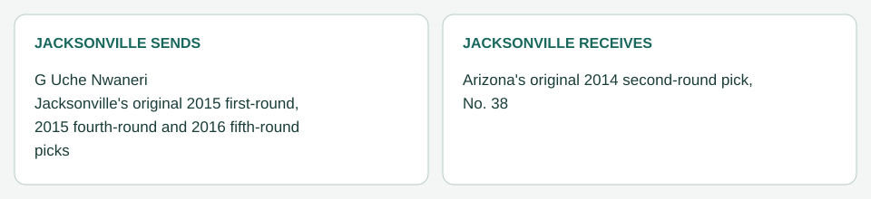

# Jacksonville / Arizona: No. 38 (March 20, 2014)

[Completed trades](../../README.md) · [Original dated record](../../trades.md)

| Club | Receives |
|---|---|
| Jacksonville | Arizona's original 2014 second-round pick, No. 38 |
| Arizona | G Uche Nwaneri; Jacksonville's original 2015 first-round, 2015 fourth-round and 2016 fifth-round picks |

- Negotiation: Jacksonville offered the three picks, Alualu and Nwaneri on March 18; Arizona countered without Alualu on March 19, and Caldwell accepted ([negotiation record](../../../01_targets_and_offers/package_i_negotiation_2014-03-20.md)).
- Closing: Nwaneri passed his physical; branch medical disclosure showed no communicated restriction. Processed March 20, before his March 25 roster bonus, which passes to Arizona.
- Accounting (Jacksonville): about $5,894,500 of 2014 charge removed; $2,189,000 of bonus proration (the 2014 and 2015 allocations) accelerates into 2014 dead money; his 2015 working charge ($5,894,500) is removed.
- Picks: [ownership register](../../../../04_draft/pick_ownership.json) and [draft order](../../../../04_draft/draft_order.md) updated. Jacksonville holds no 2015 pick before round 3.
- Draft plan: No. 38 is Davante Adams; No. 26 becomes Joel Bitonio, then Kyle Van Noy. Availability at each pick is decided at the draft by the rails rule.
- Ledger: [2013 ledger, Nwaneri traded for No. 38](../../../../../2013/ledger.md#entry-99-cain-re-signed-nwaneri-traded-to-arizona-for-no-38-package-i).
