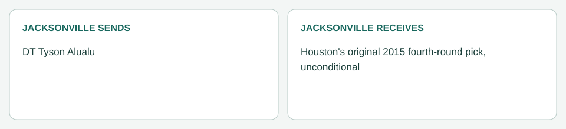

# Jacksonville / Houston: Alualu (March 24, 2014)

[Completed trades](../../README.md) · [Original dated record](../../trades.md)

| Club | Receives |
|---|---|
| Jacksonville | Houston's original 2015 fourth-round pick, unconditional |
| Houston | DT Tyson Alualu |

- Resolution: the user's trade-dynamics run ([resolution log](../../../supporting_records/march_24_2014_trade_resolution.md)).
- Closing: Alualu passed Houston's physical; branch medical disclosure showed no communicated restriction. Processed March 24.
- Accounting (Jacksonville): his $4,264,000 2014 charge is removed. The final $1,542,500 original bonus allocation stays with Jacksonville as 2014 dead money. His contract ended after 2014, so no later year changes.

The Babin and Alualu trades are recorded together in the [2014 ledger](../../../../ledger.md).
