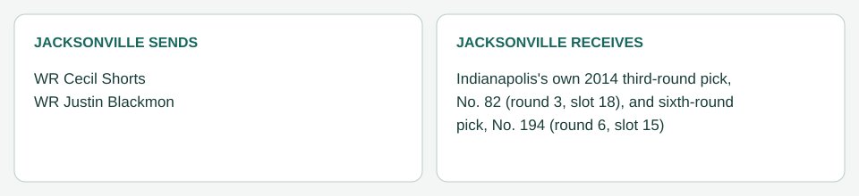

# Jacksonville / Indianapolis: Shorts and Blackmon (March 31, 2014)

[Completed trades](../../README.md) · [Original dated record](../../trades.md)

| Club | Receives |
|---|---|
| Jacksonville | Indianapolis's own 2014 third-round pick, No. 82 (round 3, slot 18), and sixth-round pick, No. 194 (round 6, slot 15) |
| Indianapolis | WR Cecil Shorts; WR Justin Blackmon |

- Negotiation: Stone asked for draft picks, ideally one in rounds 2 to 4, with Jacksonville taking the dead money. Seattle declined No. 36 for both; Carolina offered No. 119 for Shorts alone; the Colts refused No. 51, offered No. 82 for Shorts and added No. 194 to take Blackmon. Caldwell accepted ([trade record](../../shorts_blackmon_to_indianapolis_2014-03-31.md)).
- Closing: both players passed the Colts' physicals on March 31 with no communicated restriction. Processed March 31. Both picks are clean ordinary picks with no condition.
- Accounting (Jacksonville): Shorts's $1,541,845 2014 charge is removed and his final $110,845 bonus allocation stays as 2014 dead money. Blackmon's $5,048,728 2014 charge is removed; his remaining bonus allocation ($2,975,818 for 2014 and $2,975,818 for 2015, $5,951,636 in all) accelerates into 2014 dead money (pre-June 1 trade), and his 2015 charge leaves. Indianapolis takes both contracts from March 31.
- Picks: Nos. 82 and 194 became Jacksonville's, giving it 11 picks in 2014. Both went to Washington later the same day (below).
