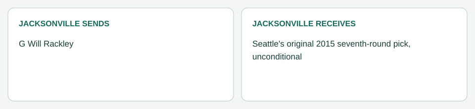

# Jacksonville / Seattle: Rackley (May 12, 2014)

[Completed trades](../../README.md) · [Original dated record](../../trades.md)

| Club | Receives |
|---|---|
| Jacksonville | Seattle's original 2015 seventh-round pick, unconditional |
| Seattle | G Will Rackley |

- Negotiation: Stone asked Caldwell to shop Rackley for an unconditional 2015 seventh, with a 2016 seventh or a conditional 2015 seventh as fallbacks, and to keep Brewster. Caldwell called the six clubs on the line-needy list on May 11; San Francisco, Carolina, New England and Houston had drafted interior linemen, Chicago had re-signed Matt Slauson, and Seattle, which lost Paul McQuistan to Cleveland in March and drafted no interior lineman, accepted the ask without a counter ([trade record](../../rackley_to_seattle_2014-05-12.md)).
- Closing: Rackley passed Seattle's physical on May 12; his Week 5 upper-extremity limitation was disclosed and carries no projected absence. Processed May 12. The pick is a clean ordinary pick with no condition.
- Accounting (Jacksonville): his $1,585,868 2014 charge is removed. His final $154,868 original bonus allocation stays with Jacksonville as 2014 dead money (pre-June 1 trade); Seattle takes his $1,431,000 base. His contract ended after 2014, so no later year changes. One $495,000 base moves back inside the offseason Top 51, so the working difference improves by $936,000.
- Picks: Seattle's 2015 seventh is Jacksonville's ([ownership register](../../../../04_draft/pick_ownership.json)). Jacksonville's 2015 picks are now its own second, Miami's third, Houston's fourth, Arizona's fourth and Seattle's seventh.
- Rails: a trade is not Rackley's real 2014 move, so he does not follow one; he is a branch player on Seattle's roster.
