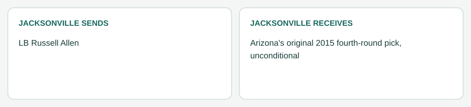

# Jacksonville / Arizona: Allen (April 7, 2014)

[Completed trades](../../README.md) · [Original dated record](../../trades.md)

| Club | Receives |
|---|---|
| Jacksonville | Arizona's original 2015 fourth-round pick, unconditional |
| Arizona | LB Russell Allen |

- Resolution: agreed in principle March 24 in the user's trade-dynamics run ([resolution log](../../../supporting_records/march_24_2014_trade_resolution.md)), to close automatically once its conditions were met, with no further negotiation.
- Closing: Paul Posluszny was cleared on April 5, his projected return date, well before the April 21 limit. Allen passed Arizona's physical on April 7 and the trade was processed that day.
- Accounting (Jacksonville): Allen's $2,416,668 2014 charge is removed. His final $416,668 original bonus allocation stays with Jacksonville as 2014 dead money (pre-June 1 trade); Arizona takes his $1,975,000 base and $25,000 workout bonus. His contract ended after 2014, so no later year changes.
- Picks: Arizona's 2015 fourth is Jacksonville's ([ownership register](../../../../draft/pick_ownership.json)). Jacksonville's 2015 picks are now its own second, Miami's third, Houston's fourth and Arizona's fourth.
- Rails: Allen's real retirement, dated April 22, 2014, now applies at Arizona. It has no Jacksonville cap effect.
