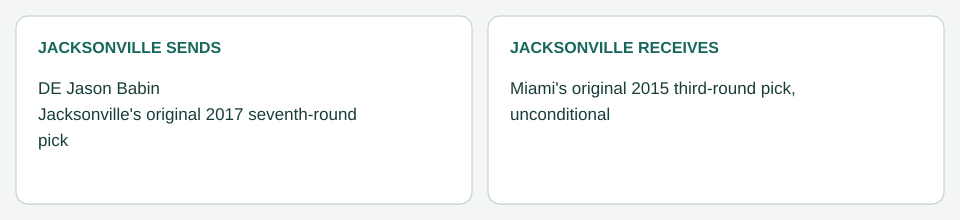

# Jacksonville / Miami: Babin (March 24, 2014)

[Completed trades](../../README.md) · [Original dated record](../../trades.md)

| Club | Receives |
|---|---|
| Jacksonville | Miami's original 2015 third-round pick, unconditional |
| Miami | DE Jason Babin; Jacksonville's original 2017 seventh-round pick |

- Resolution: the user's trade-dynamics run ([resolution log](../../../supporting_records/march_24_2014_trade_resolution.md)). A straight trade: the earlier appearance condition is removed.
- Closing: Babin passed Miami's physical; branch medical disclosure showed no communicated restriction. Processed March 24.
- Accounting (Jacksonville): his $6,175,000 2014 and $6,175,000 2015 working charges are removed. No bonus allocation remains on the claimed Philadelphia contract, so there is no dead money.
- Picks: Miami's 2015 third is Jacksonville's; Jacksonville's 2017 seventh is Miami's and unavailable for any later deal ([ownership register](../../../../draft/pick_ownership.json)).
