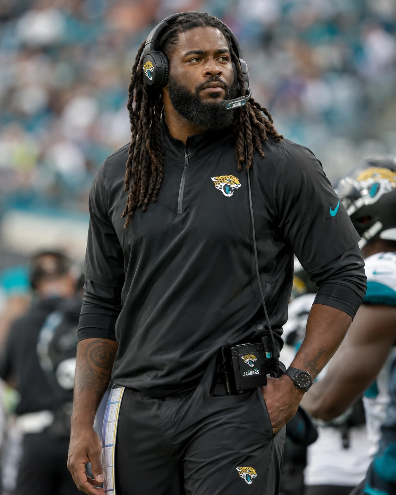

# Alex Stone: NFL Coach Sheet

<!-- photo -->

*Photo: supplied by the user, October 1, 2026.*
<!-- /photo -->

**Jacksonville Jaguars head coach. Current through August 4, 2014; calling responsibility through September 28, 2014.**

[Coaching profile](alex_stone_coaching_profile.md) | [Performance and job security](alex_stone_performance_review.md)

## Background

Alex-Lamar Stone, known professionally as Alex Stone, was born September 21, 1963 in Miami, Florida. He is 50 at this cutoff, married to Inbar Zsela-Stone and has no children. He speaks native English, conversational Spanish and limited Arabic, French and Japanese.

| Education | Year |
|---|---|
| BS, University of Miami | 1986 |
| MBA, University of San Diego | 1996 |
| PhD, Exercise Physiology, University of Miami | 2002 |

His doctoral work concerned motor-learning acquisition and retention. After residence in 1996-1997 and qualifying exams and proposal work in 1998, he completed the dissertation part-time while coaching.

**Playing career:** Miami tight end, 1982-1985; member of the 1983 national championship team under Howard Schnellenberger, then coached by Jimmy Johnson in his final two college seasons. San Diego Chargers, 1986-1995; retired after 1995. Playing size: 6 ft 4 in, 235 lb. Career: 150 games, 488 receptions, 5,912 yards, 44 touchdowns, five Pro Bowls and two first-team All-Pro selections. Played in the 49-26 Super Bowl XXIX loss to San Francisco on January 29, 1995. These are the character's established records.

## Coaching appointments

| Seasons | Appointment | Responsibility |
|---|---|---|
| 1996-1997 | Miami, offensive graduate assistant | Offensive preparation and teaching |
| 1998 | No football appointment | Doctoral work; excluded from coaching-season totals |
| 1999 | Miami Dolphins, offensive quality control / assistant quarterbacks | Opponent and quarterback preparation under Jimmy Johnson |
| 2000 | University of San Diego, offensive coordinator / quarterbacks | Primary caller under Kevin McGarry |
| 2001 | University of San Diego, assistant head coach / offensive coordinator / quarterbacks | Primary caller with broader practice and game-management duties |
| 2002-2004 | New England, defensive assistant | Secondary work with Eric Mangini under Romeo Crennel |
| 2005-2006 | New England, tight ends | Position coaching |
| 2007-2008 | New England, passing-game coordinator / tight ends | Passing preparation; selected preseason calls. Josh McDaniels called regular-season games. |
| 2009-2010 | New Orleans, offensive coordinator | Weekly offensive plan; Sean Payton called games. Pete Carmichael Jr. and Aaron Kromer shared offensive responsibilities. |
| 2011 | New Orleans, offensive coordinator | Primary caller from Payton's Week 6 injury through the playoffs; Payton continued contributing. |
| 2012 | New Orleans, interim head coach / offensive coordinator | Full team responsibility and offensive calling from April 16 through the playing season ending January 13, 2013. Administrative end date not separately established. |
| 2013-present | Jacksonville, head coach | Appointed January 15, 2013; program, staff and offensive calling; defensive calling from Week 4 of 2014 (September 28), Crennel having called the defense before it |

Through 2013: **17 completed coaching seasons, 13 NFL seasons, two NFL head-coaching seasons.** Assistant Super Bowl championships: New England in 2003 and 2004; New Orleans in 2009. Stone was a [2013 Coach of the Year finalist](../2013/awards/season_honours.md); Rex Ryan won.

After the 2011 season, Oakland interviewed Stone twice without an offer and Indianapolis once without a second interview. Tampa Bay and Miami interest went through his agent; no interviews are established.

## Head-coaching record

| Season | Club | Regular season | Win % | Postseason | Finish |
|---|---|---|---|---|---|
| 2012 | New Orleans, interim | 12-4 | 75.0% | 1-1 | Second in NFC South; Divisional round |
| 2013 | Jacksonville | 10-6 | 62.5% | 1-1 | Second in AFC South; Divisional round |
| Career | | **22-10** | **68.8%** | **2-2** | **Two playoff appearances; 24-12 combined** |

Preseason is excluded. The 2014 regular season is in progress: 3-1 through Week 4 (September 28, 2014), from `python scripts/render_coach_record.py 2014`; its season row is added when the season closes. Records throughout this sheet belong to this simulation's career.

## 2013 Jacksonville season statistics

Regular season only: 16 games. Ranks compare all 32 simulated clubs; **T** means tied. Offense was called by Stone, with Tice coordinating the week; defense was coordinated and called by Crennel under Stone's head-coach oversight.

| Measure | Jacksonville offense | Rank | Opponents against Jacksonville | Defensive rank |
|---|---|---|---|---|
| Team points, total / game | 356 / 22.3 | 12 | 346 / 21.6 | T-15 |
| Total net yards, total / game | 5,777 / 361.1 | 15 | 5,349 / 334.3 | 5 |
| Net passing yards / game | 233.4 | 12 | 219.1 | 10 |
| Rushing yards / game | 127.7 | 15 | 115.2 | 5 |
| Net yards / play | 5.52 | 14 | 5.33 | 11 |
| First downs, total / game | 318 / 19.9 | T-21 | 319 / 19.9 | 9 |
| First downs per 100 plays | 30.4 | 26 | 31.8 | 18 |
| Third-down conversions / attempts | 88/222, 39.6% | 13 | 67/199, 33.7% | 3 |
| Giveaways / defensive takeaways | 25 giveaways | T-22 | 15 takeaways | 31 |
| Sacks allowed / made | 38 allowed | T-25 | 23 made | 31 |

**Top-10 finishes in 2013:** defense in total net yards allowed (5th), net passing yards allowed (10th), rushing yards allowed (5th), first downs allowed (9th) and third-down defense (3rd). None of the offensive measures above finished in the top ten. Scoring margin: **plus-10**; turnover differential: **minus-10**.

**Postseason:** 1-1; 51 points scored, 34 allowed. Beat Kansas City 38-14 in the Wild Card round; lost at Tennessee 20-13 in the Divisional round. These two games are excluded from the table and its ranks.

### Definitions and coverage

- Net passing yards subtract sack losses: Jacksonville 3,981 minus 247 = 3,734; opponents 3,653 minus 147 = 3,506. Add rushing yards, 2,043 and 1,843 respectively, for total net offense. The generated [team table](../2013/stats/team_stats.md) currently uses gross passing yards in its yardage columns; this sheet uses the NFL net convention.
- First downs per 100 plays = recorded first downs divided by rush attempts, pass attempts and sacks, multiplied by 100. The denominators are 1,047 Jacksonville plays and 1,003 opponent plays. This measures first-down production across all downs, not success on first down. Third-down percentage uses conversions divided by attempts.
- Ranks use unrounded values. More production ranks higher on offense; less allowed ranks higher on defense. Fewer giveaways and sacks allowed rank higher; more takeaways and sacks made rank higher. Points include all team scoring. Displayed decimals use ordinary rounding.
- The [season totals](../2013/stats/season_totals.json) and [256 regular-season receipts](../2013/stats/game_receipts/) supply the figures; receipt player counters supply sack losses. [Postseason receipts](../2013/stats/postseason_receipts/) supply the separate playoff results. Full-season red-zone and fourth-down rates are not available and are not filled from partial coverage. The NFL's [Guide for Statisticians](https://www.nflgsis.com/gsis/documentation/stadiumguides/guide_for_statisticians.pdf), pages 5-6 and 13-15, supplies statistical definitions, not simulation results.

## Earlier New Orleans production

These regular-season figures come from the [prehire dossier](../../library/alex_stone_character_dossier_pre_hire.md#5-new-orleans-offensive-record). Calling responsibilities are listed above.

| Season | Team record | Recorded offensive production |
|---|---|---|
| 2009, OC | 13-3; Super Bowl champion | 510 points; 6,461 yards. First in NFL points and total yards. Rushing rose from 1,594 yards in 2008 to 2,106. |
| 2010, OC | 11-5; Wild Card loss | 384 points; sixth in total yards, third in passing. 31 turnovers; Brees threw 22 interceptions. |
| 2011, OC | 13-3; Divisional loss | 547 points; 7,474 yards. Brees: 5,476 passing yards, 46 TD. Team went 9-1 over its final ten regular-season games. |
| 2012, interim HC | 12-4; Divisional loss | Approximately 505 points, 6,980 yards and 18 turnovers. Brees: approximately 440/636, 5,210 yards, 42 TD, 12 INT. |

The established 2012 defensive baseline is approximately 350 points and 5,900 yards allowed, 29 takeaways and 38 sacks. These approximate figures do not support exact rates or league ranks. The 2013 table is the first complete 32-team comparison available here; it is not a count of top-ten finishes across Stone's entire career.

## Current contract and authority

Stone accepted a four-year, fully guaranteed contract on January 15, 2013. He was retained on January 15, 2014 without an extension, raise or authority change. Compensation is unspecified.

Stone selects his staff and controls coaching assignments, the depth chart, game-day decisions and the offensive plan. Tice coordinates the offensive week, Crennel coordinates the defense and Westhoff has run special teams since February 11, 2014; Stone calls the defense himself from Week 4 of 2014 (his September 21 instruction), Crennel transmitting the call ([Week 4 record](../2014/05_Regular_Season/Games/Week_04/output.md)). Stone may delegate or resume calling any phase. Caldwell has final authority over scouting, acquisitions, the draft, contracts and the cap; major quarterback commitments require Stone's written projection and consultation. Clinicians control medical clearance and restrictions.

Sources: [identity and authority](../../foundation/03_Head_Coach_Organization_and_Authority_Canon.md), [prehire dossier](../../library/alex_stone_character_dossier_pre_hire.md), [accepted contract](../2013/offseason/head_coach_contract.md), [owner review](../2013/season_review/owner_and_gm_review.md), [standings](../2013/standings.md), [current staff](../2014/00_Team_Operations/Staff/coaching_staff.md) and [Westhoff appointment](../2014/01_Early_Offseason/staff_changes/hires.md).
